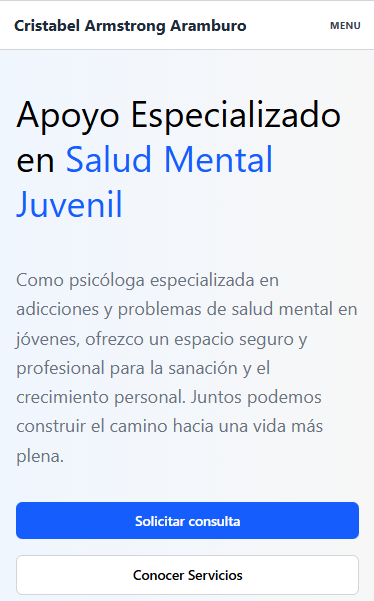
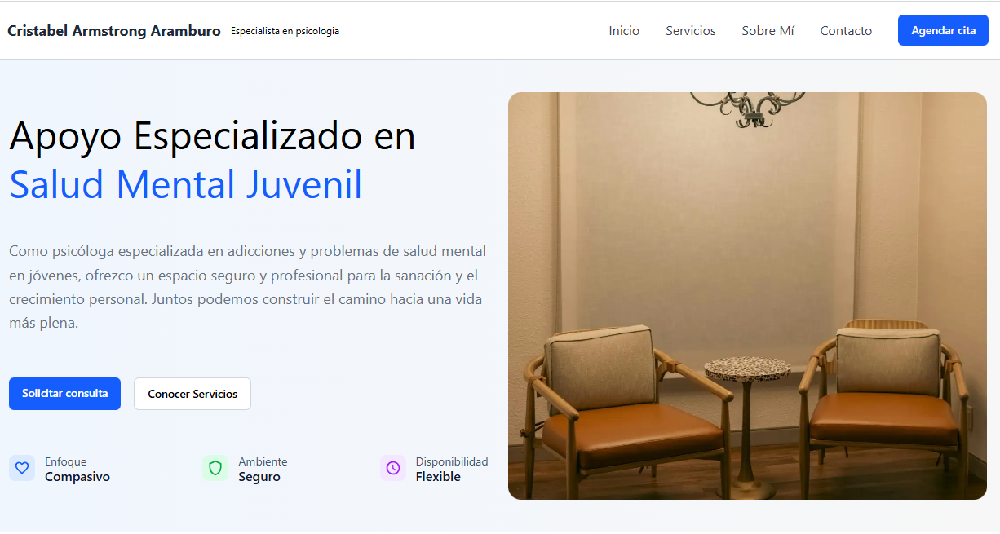

# 🧠 Psychology Landing Page - Cristabel Armstrong Áramburo

### Landing page profesional para servicios de psicología clínica desarrollada con tecnologías web modernas.

[🌐 Ver Demo en Vivo](https://landing-psychology.vercel.app/)

---

## 📋 Tabla de Contenidos

- [Descripción](#-descripción)
- [Características](#-características)
- [Tecnologías](#-tecnologías)
- [Capturas de Pantalla](#-capturas-de-pantalla)
- [Licencia](#-licencia)
- [Contacto](#-contacto)

---

## 🎯 Descripción

Landing page moderna y responsive diseñada para presentar los servicios profesionales de psicología de Cristabel Armstrong Áramburo. El sitio ofrece una experiencia de usuario intuitiva y accesible, facilitando el contacto con potenciales pacientes y proporcionando información clara sobre los servicios ofrecidos.

### Propósito

Este proyecto busca proporcionar una presencia digital profesional para servicios de psicología, permitiendo a los usuarios:
- Conocer los servicios de terapia disponibles
- Obtener información sobre la profesional
- Agendar citas de manera sencilla
- Acceder a recursos y artículos de interés

---

## ✨ Características

- ✅ **Diseño Responsive**: Adaptado para dispositivos móviles, tablets y escritorio
- ✅ **Interfaz Moderna**: UI/UX limpia y profesional
- ✅ **Rendimiento Optimizado**: Carga rápida y experiencia fluida
- ✅ **SEO Optimizado**: Metadatos y estructura optimizada para buscadores
- ✅ **Accesibilidad**: Cumple con estándares WCAG
- ✅ **Formulario de Contacto**: Sistema integrado para consultas
- ✅ **Integración de Calendario**: Sistema de agendamiento (opcional)
- ✅ **Animaciones Suaves**: Transiciones y efectos visuales elegantes

---

## 🛠 Tecnologías

Este proyecto está construido con:

### Frontend
- **Framework**: React 18+
- **Styling**: Tailwind CSS 
- **Animaciones**: CSS Animations 

### Herramientas de Desarrollo
- **Build Tool**: Vite
- **Package Manager**:pnpm
- **Linting**: ESLint
- **Formatting**: Prettier

### Despliegue
- **Hosting**: Vercel
- **CI/CD**: Vercel Git Integration

---

## 📸 Capturas de Pantalla

### Mobile

### Tablet

### Desktop

---

## 📄 Licencia

Este proyecto está bajo la Licencia MIT. Ver el archivo [LICENSE](LICENSE) para más detalles.

---

## 👤 Contacto

**Cristabel Armstrong Áramburo**

- Email: pablozalliodev@gmail.com
- LinkedIn: [Pablo Zallio](https://www.linkedin.com/in/pablozalliodev/)
- GitHub: [pablo-zallio-dev](https://github.com/Pablo-Zallio-Dev)

---

## 🙏 Agradecimientos

- [React](https://reactjs.org/) - Framework JavaScript
- [Vercel](https://vercel.com/) - Plataforma de despliegue

---

Hecho con ❤️ por Pablo Zallio DeV

⭐ ¡Dale una estrella si te gustó este proyecto! ⭐

